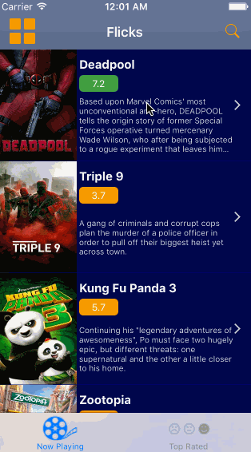

# Project 1 - *Flicks*

**Flicks** is a movies app using the [The Movie Database API](http://docs.themoviedb.apiary.io/#).

Time spent: **12** hours spent in total

## User Stories

The following **required** functionality is complete:

- [x] User can view a list of movies currently playing in theaters from The Movie Database.
- [x] Poster images are loaded using the UIImageView category in the AFNetworking library.
- [Tried, worked, but did not show graphics] User sees a loading state while waiting for the movies API.
- [Tried, worked, but did not show graphics] User can pull to refresh the movie list.

The following **optional** features are implemented:

- [Tried, worked, but did not show graphics] User sees an error message when there's a networking error.
- [ ] Movies are displayed using a CollectionView instead of a TableView.
- [x] User can search for a movie.
- [ ] All images fade in as they are loading.
- [ ] Customize the UI.

The following **additional** features are implemented:

- [x] Clicking Search withdraws Keyboard but keeps filtered movies whereas clicking Cancel withdraws keyboard and shows all movies
- [x] Ratings are visable with collors showing good or bad
- [Tried, worked, but did not show graphics] Once network error resolves, the network error view can withdrawn by clicking on it (part of optional feature) and also by pull-down refresh (additional feature). 

Please list two areas of the assignment you'd like to **discuss further with your peers** during the next class (examples include better ways to implement something, how to extend your app in certain ways, etc):

1. Setting CollectionViewLayout values.
2. swift optionals, wrapping. unwrapping etc

## Video Walkthrough 

Here's a walkthrough of implemented user stories:

Replaced File

## Notes

Describe any challenges encountered while building the app.
1. Had to start over many times beacuse app would run but graphics wouldn't load

## License

    Copyright [2016] [Donatea Zefi]

    Licensed under the Apache License, Version 2.0 (the "License");
    you may not use this file except in compliance with the License.
    You may obtain a copy of the License at

        http://www.apache.org/licenses/LICENSE-2.0

    Unless required by applicable law or agreed to in writing, software
    distributed under the License is distributed on an "AS IS" BASIS,
    WITHOUT WARRANTIES OR CONDITIONS OF ANY KIND, either express or implied.
    See the License for the specific language governing permissions and
    limitations under the License.# Flicks

# Project 2 - *Flicks App*

**Flicks APP** is a movies app displaying box office and top rental DVDs using [The Movie Database API](http://docs.themoviedb.apiary.io/#).

Time spent: **10** hours spent in total

## User Stories

The following **required** functionality is completed:

- [x] User can view movie details by tapping on a cell.
- [x] User can select from a tab bar for either **Now Playing** or **Top Rated** movies.
- [x] Customize the selection effect of the cell.

The following **optional** features are implemented:

- [x] For the large poster, load the low resolution image first and then switch to the high resolution image when complete.
- [x] Customize the navigation bar.

The following **additional** features are implemented:

- [x] Clicking Search withdraws Keyboard but keeps filtered movies whereas clicking Cancel withdraws keyboard and shows all movies
- [x] Ratings are visable with collors showing good or bad
- [x]Once network error resolves, the network error view can withdrawn by clicking on it (part of optional feature) and also by pull-down refresh (additional feature). 

## Video Walkthrough 

Here's a walkthrough of implemented user stories:

GIF created with [LiceCap](http://www.cockos.com/licecap/).

## Notes

Creating a Grid View

## License

    Copyright [2016] [Donatea Zefi]

    Licensed under the Apache License, Version 2.0 (the "License");
    you may not use this file except in compliance with the License.
    You may obtain a copy of the License at

        http://www.apache.org/licenses/LICENSE-2.0

    Unless required by applicable law or agreed to in writing, software
    distributed under the License is distributed on an "AS IS" BASIS,
    WITHOUT WARRANTIES OR CONDITIONS OF ANY KIND, either express or implied.
    See the License for the specific language governing permissions and
    limitations under the License.
    
